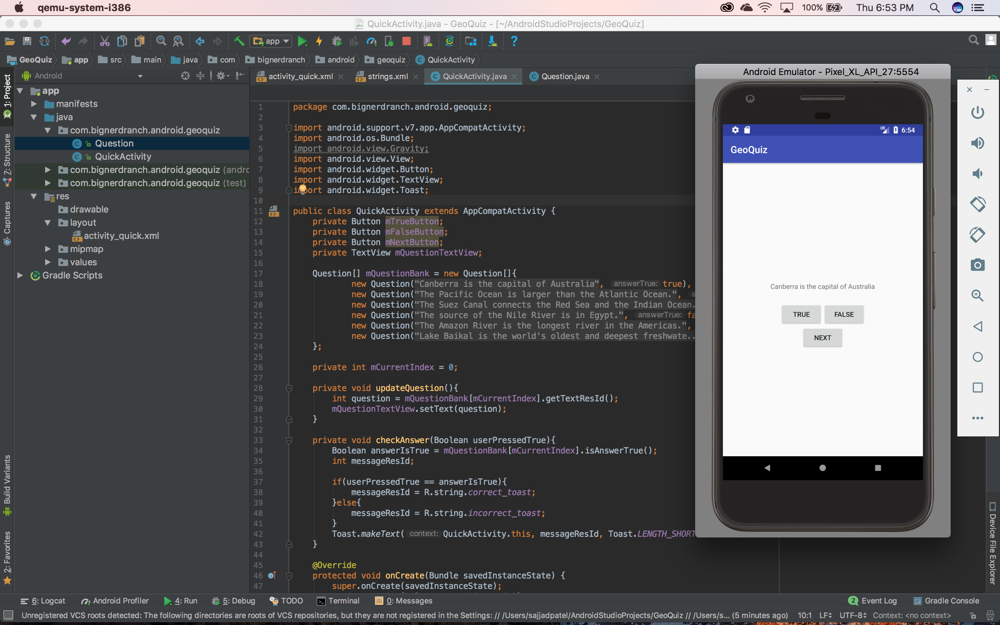

# GeoQuiz

## Repo Description
Utilized Java, XML, and Android Studio to build a geography quiz app for Android devices, which enables users to answer numerous true or false questions. Prepared technical documentation, including use case documents, class diagrams, and low-fidelity and high-fidelity user interface designs.

## UPDATE 6

## UPDATE 4

## UPDATE 3.9

## UPDATE 3

## INITIAL

